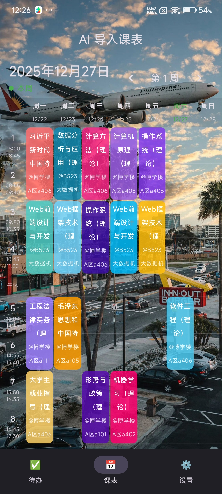
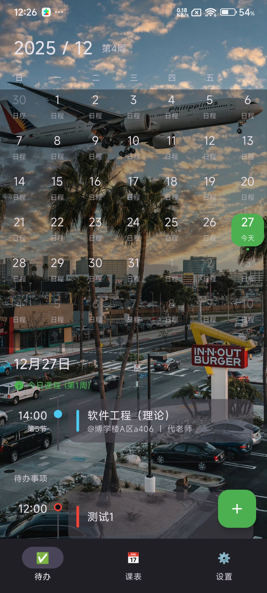
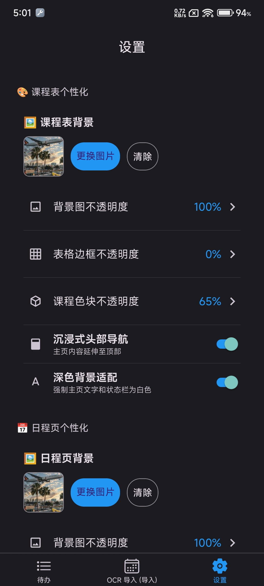
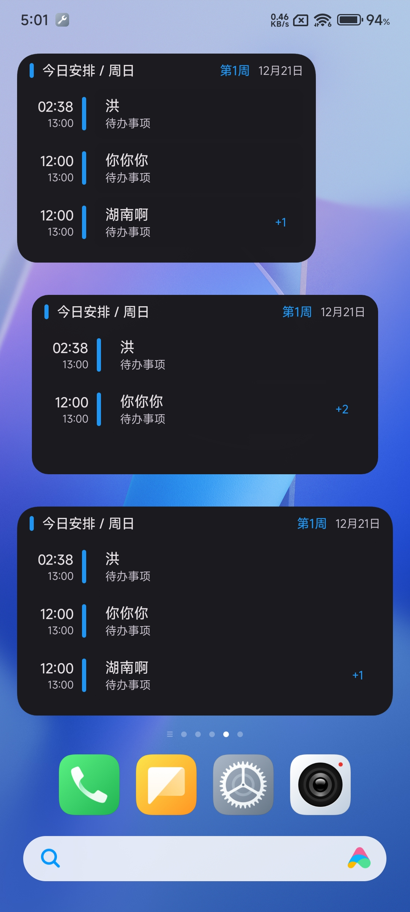

<div align="center">
  

  <h1 align="center">集盒 (JiHe)</h1>

  <p align="center">
    <strong>一个极简、强大且高度个性化的 Android 原生学生日程管理助手</strong>
  </p>

  <p align="center">
    
    
    
    
    
  </p>
</div>

---
<div align="center">
  <a href="https://wsryhc.top/jihe-schedule/">
    
  </a>
</div>

## 📖 简介 | Introduction

**集盒 (JiHe)** 是一款专为学生群体设计的现代化 Android 应用。

> **⚠️ 重构说明**：本项目最初使用 React Native 开发，为了追求极致的性能、更好的桌面小组件体验以及对 Android 新特性的完美支持，现已使用 **Kotlin + Jetpack Compose** 完全重写。

它集成了**智能课程表**、**待办事项管理**、**原生桌面小组件**以及**强大的个性化系统**。无论是复杂的大学排课（单双周、多时段），还是琐碎的作业考试提醒，集盒都能帮你井井有条地管理。

## ✨ 核心功能 | Features

### 📅 智能课程表 (Smart Schedule)
* **多课表切换**：支持创建和管理多个学期课表，一键切换当前生效课表。
* **复杂排课支持**：完美支持单双周、自定义周次范围、冲突检测，每天支持配置早/中/晚不同节数。
* **OCR 离线导入**：集成 **Google ML Kit**，支持离线识别教务系统截图，智能提取课程信息（无需联网，隐私安全）。
* **AI 辅助导入**：支持通过 Prompt 生成标准 JSON 数据，实现一键导入。

### ✅ 待办事项 (Todo)
* **日程管家**：支持作业、考试、生活等多种分类。
* **强力提醒**：基于 Android **AlarmManager** 的准点提醒与提前提醒，确保不错过任何 DDL。
* **双视图模式**：提供清晰的列表视图与直观的日历月视图。

### 🧩 原生小组件 (Jetpack Glance)
* **现代化组件**：使用 Google 最新的 **Glance** 技术构建，流畅且省电。
* **尺寸修改支持**：可以直接在屏幕上长按拖动以实现大小的改变。
* **深度交互**：无需打开 App，直接在桌面勾选待办事项、查看今日/明日课程。
* **自由调整**：支持长按拖动调整大小，布局自动适配 (Responsive Layout)。

### 🎨 深度个性化 (Customization)
* **沉浸式体验**：支持自定义背景图片，可精细调节背景、边框、卡片的透明度。
* **界面适配**：支持“沉浸式头部导航”与“深色背景强制反白”，完美适配各种风格壁纸。
* **动态主题**：内置多种莫兰迪色系主题色，支持跟随系统自动切换深色模式 (Dark Mode)。

## 📸 预览 | Screenshots

| 主页 (课程表) | 待办事项 (日历) | 个性化设置 | 桌面小组件 |
| :---: | :---: | :---: | :---: |
|  |  |  |  |

> *注：开发预览图，实际效果以最新版本为准*

## 🛠️ 技术栈 | Tech Stack

本项目完全采用现代 Android (Modern Android Development) 标准构建：

* **Language**: [Kotlin](https://kotlinlang.org/) (Pure Kotlin Project)
* **UI Framework**: [Jetpack Compose](https://developer.android.com/jetpack/compose) (Material Design 3)
* **Architecture**: MVVM (Model-View-ViewModel) + Unidirectional Data Flow
* **Data Storage**: 
  * [Room Database](https://developer.android.com/training/data-storage/room) (SQLite ORM)
  * [DataStore](https://developer.android.com/topic/libraries/architecture/datastore) (Preferences)
* **Widgets**: [Jetpack Glance](https://developer.android.com/jetpack/compose/glance)
* **Background Tasks**: [WorkManager](https://developer.android.com/topic/libraries/architecture/workmanager) & AlarmManager
* **Machine Learning**: [Google ML Kit](https://developers.google.com/ml-kit) (Text Recognition v2)
* **Image Loading**: [Coil](https://coil-kt.github.io/coil/)
>*注: 在进行开发的过程中，使用了AI的帮助，进行修改实现方法。*

## 🚀 快速开始 | Getting Started

1.  前往 [Releases](https://github.com/wsryhc/JiHe-Schedule-Android/releases) 页面下载最新 APK。
2.  安装后建议在系统设置中授予**通知权限**与**自启动权限**，以保证提醒功能的正常运作。

### 编译指南 (For Developers)

```bash
# 1. 克隆项目
git clone [https://github.com/wsryhc/JiHe-Schedule-Android.git](https://github.com/wsryhc/JiHe-Schedule-Android.git)

# 2. 打开项目
使用 Android Studio Ladybug 或更新版本打开

# 3. 同步依赖
等待 Gradle Sync 完成 (确保网络环境正常以下载 Maven 依赖)

# 4. 运行
连接真机或模拟器运行
```
## ⚠️ 注意事项 | Notes

* **小组件刷新**：Android 系统对小组件刷新频率有限制。本项目已通过前台服务和广播机制优化刷新速度，但为了省电，部分非关键更新可能会有数秒延迟。
* **后台保活**：由于国产 ROM 的严格限制，如果发现提醒不准时，请将应用锁定在后台并允许后台高耗电（无限制）。

## 🗺️ 开发计划 | Roadmap

- [x] 基于 Jetpack Compose 重构核心 UI
- [x] Room 数据库迁移与数据持久化
- [x] 基于 Glance 的原生桌面小组件
- [x] ML Kit 离线 OCR 课程导入
- [x] 导入/导出 JSON 备份
- [ ] 更多功能的添加与适配
- [ ] iOS 平台适配
- [ ] 桌面端 (Windows/Mac) 支持
- [ ] 课程表导入适配更多学校教务系统 (教务适配器)

## 🤝 贡献 | Contributing

欢迎提交 Issue 或 Pull Request！如果你有好的想法，欢迎在 Issues 中讨论。

## 📄 许可证 | License

本项目采用 [MIT License](LICENSE) 许可证。

---

<p align="center">
  Made with ❤️ by <a href="https://github.com/wsryhc">wsryhc</a>
</p>